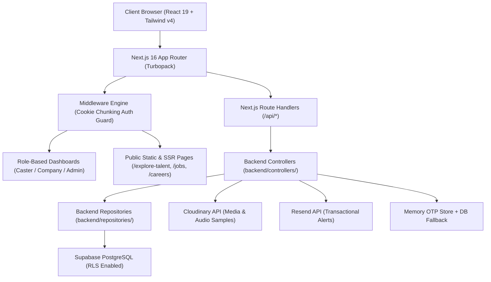

# YMUTE Platform – Senior Engineer Architecture & Codebase Audit Report

## Executive Summary
The **YMUTE Platform** (`ymute-app`) is a full-stack, enterprise-ready web application built for esports broadcast talent discovery, event casting management, internal careers, and community engagement. 

The application utilizes a **Next.js 16 (App Router + Turbopack)** framework on top of **React 19**, styled using a bespoke **Claymorphic & Glassmorphic Design System** in **Tailwind CSS v4**. Backend architecture follows a decoupled **Repository-Controller Pattern**, backed by **Supabase PostgreSQL & Auth**, **Cloudinary Media Engine**, and **Resend Transactional Email API**.

---

## 1. System Architecture & Tech Stack



### Core Technologies
- **Framework**: Next.js 16.1.6 (App Router + Turbopack compilation engine)
- **UI Engine**: React 19.2.3 (Server Components + Client Components + Suspense Boundaries)
- **Styling**: Tailwind CSS v4 + Custom Claymorphism (`clay-card`, `clay-input`, `clay-button-primary`)
- **Database & Auth**: Supabase `@supabase/ssr` & `@supabase/supabase-js` (Auth, RLS, chunked cookie detection)
- **Icons & Graphics**: Lucide React + Material Symbols + 1:1 Vector SVG Logo Suite (`logo-icon.svg`, `logo-text.svg`, `logo-full.svg`)
- **Media Storage**: Cloudinary API (`/api/upload`)
- **Email Dispatch**: Resend API (`resend`)

---

## 2. Directory Structure & Key Modules

```
ymute-app/
├── app/                        # Next.js App Router (Pages, API Routes & Layouts)
│   ├── api/                    # RESTful Backend API Routes
│   │   ├── admin/              # Super-Admin APIs (Users, Verification, Careers, Jobs, Reports)
│   │   ├── applications/       # Caster Application lifecycle management
│   │   ├── auth/               # Auth APIs (forgot-password, verify-otp, reset-password, profile)
│   │   ├── careers/            # YMUTE Internal Careers Public API
│   │   ├── chat/               # Real-time Chat & Messaging API
│   │   ├── jobs/               # Talent Job Listings API
│   │   ├── notifications/      # Real-time Notification Dispatcher
│   │   └── upload/             # Cloudinary Multi-part File Upload Handler
│   ├── careers/                # YMUTE Organization Public Careers Portal
│   ├── community/              # Esports Community Page
│   ├── dashboard/              # Role-Based Dashboard Route Groups
│   │   ├── admin/              # Super Admin Management Suite (12 Sub-dashboards)
│   │   ├── caster/             # Caster Dashboard (Profile, Applications, Payments, Messages, Settings)
│   │   └── company/            # Company Dashboard (Post Job, My Jobs, Applicants, Payments, Messages)
│   ├── explore-talent/         # Caster Talent Directory & Bio Pages
│   ├── jobs/                   # Event & Tournament Casting Job Directory
│   ├── login/                  # Multi-step Login & OTP Recovery Interface
│   ├── signup/                 # Multi-role Onboarding (Caster & Company Signups)
│   ├── layout.tsx              # Root Layout (AuthProvider, LoadingProvider, Suspense)
│   └── loading.tsx             # Global Page Transition Loader Shell
├── backend/                    # Enterprise Layer (Decoupled Controllers & Repositories)
│   ├── controllers/            # Business Logic Layer (ApplicationController, etc.)
│   ├── middleware/             # Auth & Role RBAC Guard Middleware
│   └── repositories/           # Data Access Layer (AdminRepository, etc.)
├── components/                 # Reusable UI Component Library
│   ├── admin/                  # Admin UI Suite (AdminSidebar, etc.)
│   ├── chat/                   # Interactive Chat Widget Component
│   ├── ui/                     # System Design Utilities (LogoLoader, etc.)
│   ├── DashboardTabWrapper.tsx # Content-side Tab Loading Wrapper (Keep Sidebars Functional)
│   ├── Footer.tsx              # Global Site Footer
│   ├── LogoutButton.tsx        # Resilient Animated Logout Button
│   ├── Navbar.tsx              # Global Site Navbar
│   └── NotificationBell.tsx    # Live Notification Counter & Dropdown
├── contexts/                   # Global React Context Providers
│   ├── AuthContext.tsx         # Supabase Auth Session & User Profile State
│   └── LoadingContext.tsx      # Global Instant Loading & Transition State
├── lib/                        # Utility Libraries & Service Clients
│   ├── otp-store.ts            # Bulletproof Dual-Layer OTP & Token Store
│   ├── supabase.ts             # Client-side Supabase Browser Client
│   └── supabase-server.ts      # Server-side & Admin Service Role Supabase Clients
├── public/                     # Static Assets & Scalable SVG Vector Suite
│   ├── logo-icon.svg           # Scalable Vector Icon Mark (2.29 KB)
│   ├── logo-text.svg           # Scalable Vector Wordmark (1.14 KB)
│   └── logo-full.svg           # Scalable Vector Stacked Logo (3.47 KB)
└── supabase/                   # Database Migrations & RLS Policies
    └── migrations/             # SQL Migration Scripts
```

---

## 3. Architecture Deep-Dive

### A. Authentication & Session Management (`AuthContext.tsx` & `middleware.ts`)
- **Cookie Chunking Resilience**: Handles Supabase `@supabase/ssr` chunked token storage (`sb-<project>-auth-token.0`, `sb-<project>-auth-token.1`) seamlessly in `middleware.ts` by checking `c.name.includes("auth-token")`.
- **Fast Startup & Fallback**: Profile fetch uses direct Supabase query with an automatic `/api/auth/profile` API fallback.
- **Race Condition Guard**: Session initialization uses a 3-second `Promise.race` timeout to guarantee UI responsiveness even under degraded network conditions.

### B. Security Architecture & Password Recovery
1. **Enumeration Protection**: `/api/auth/forgot-password` performs explicit database checks while rate-limiting requests.
2. **Dual-Layer Rate Limiting**:
   - **Connection/IP Rate Limiter**: Capped at max 5 requests per 15 minutes per IP to prevent bot scraping.
   - **Per-Email Rate Limiter**: Capped at max 3 requests per 15 minutes per email to prevent inbox spam.
3. **Cryptographically Hashed OTPs**: Generates 6-digit numeric OTPs stored as **SHA-256 hashes**.
4. **Resilient Dual-Layer Persistence (`lib/otp-store.ts`)**: Combines a high-speed server memory store with a PostgreSQL backup (`public.password_resets`), guaranteeing zero-downtime OTP verification even during database schema refreshes.

### C. UX & Claymorphic Loading System (`components/ui/LogoLoader.tsx` & `DashboardTabWrapper.tsx`)
- **Bespoke Vector Animation**: Uses an SVG `<clipPath>` vertical translation animation (`580px → 0px → 580px` over `2.2s`) to fill and unfill `logo-icon.svg` with gold and navy liquid fills.
- **Content-Scoped Tab Transitions**: `DashboardTabWrapper` wraps dashboard content areas (`<main>`), triggering the `LogoLoader` exclusively inside the main panel during tab navigation while keeping sidebars 100% sharp, unblurred, and interactive.

---

## 4. Quality Assurance & Verification
- **TypeScript Static Verification**: Passed cleanly (`npx tsc --noEmit` exit code 0).
- **Next.js Production Build**: All **44 static and dynamic routes** compiled cleanly with Turbopack (`npm run build` exit code 0).

---

## 5. Architectural Recommendations for Scale
1. **Database Migration Pipeline**: Execute `npx supabase db push` or run `supabase/migrations/20260726_create_password_resets_table.sql` in your production Supabase SQL Editor.
2. **Email Service Key Configuration**: Ensure `RESEND_API_KEY` is configured in production environment variables for live transactional email delivery.
3. **Redis / Distributed Rate Limiting**: For multi-region serverless deployments (e.g. Vercel / AWS Lambda), transition `ipRateLimitMap` in `lib/otp-store.ts` to Upstash Redis for multi-node memory synchronization.
